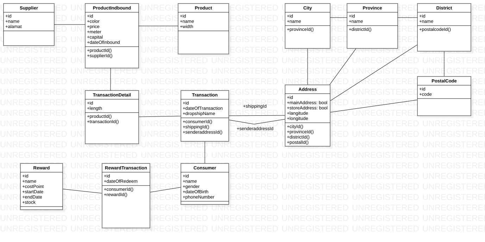

<h2 align="center">Backend GT JS 001</h2>

Sudah di Hosting di Heroku:
https://backend-gamatextile.herokuapp.com (`Work in progress`)

## Daftar Isi

- [Daftar Isi](#daftar-isi)
- [Rancangan Database Prototype](#rancangan-database-prototype)
- [Daftar API ENDPOINT](#daftar-api-endpoint)
- [Todo](#todo)
- [Lisensi](#lisensi)

## Rancangan Database Prototype

## Daftar API ENDPOINT

Api ini di test / uji dengan menggunakan Aplikasi Postman Desktop

| Nama Routes                                          | HTTP   | Deskripsi                                      | Dibuat | Hasil Test | Middleware `Auth` |
| :--------------------------------------------------- | :----- | :--------------------------------------------- | :----- | :--------- | :---------------- |
| `/api`                                               | GET    | Mendapatkan Halaman Utama dalam bentuk JSON    | Sudah  | OK         | Tidak             |
| `/api/addresses`                                     | GET    | get all address                                | Sudah  | OK         | Tidak             |
| `/api/addresses`                                     | POST   | create address                                 | Sudah  | OK         | Tidak             |
| `/api/addresses/:customerId/customer`                | GET    | get all address single customer                | Sudah  | OK         | Tidak             |
| `/api/addresses/:customerId/customer/edit`           | PUT    | update single customer address                 | Sudah  | OK         | Tidak             |
| `/api/addresses/:id/find`                            | GET    | get single address                             | Sudah  | OK         | Tidak             |
| `/api/addresses/:id/edit`                            | PUT    | update single address                          | Sudah  | OK         | Tidak             |
| `/api/addresses/:id`                                 | DELETE | delete address                                 | Sudah  | OK         | Tidak             |
| `/api/auth/signup`                                   | POST   | POST create data singin phoneNumber            | Sudah  | OK         | Tidak             |
| `/api/auth/sigin`                                    | POST   | POST singin phoneNumber                        | Sudah  | OK         | Tidak             |
| `/api/banks`                                         | GET    | get all bank                                   | Sudah  | OK         | Tidak             |
| `/api/banks`                                         | POST   | create bank                                    | Sudah  | OK         | Tidak             |
| `/api/banks/:id`                                     | GET    | get specific bank                              | Sudah  | OK         | Tidak             |
| `/api/banks/:id`                                     | PUT    | update bank                                    | Sudah  | OK         | Tidak             |
| `/api/banks/:id`                                     | DELETE | delete bank                                    | Sudah  | OK         | Tidak             |
| `/api/carts`                                         | GET    | get all cart                                   | Sudah  | OK         | Tidak             |
| `/api/carts/:customerId/customer`                    | GET    | get all cart single customer                   | Sudah  | OK         | Tidak             |
| `/api/carts/:id`                                     | GET    | get single cart                                | Sudah  | OK         | Tidak             |
| `/api/carts/`                                        | POST   | create cart                                    | Sudah  | OK         | Tidak             |
| `/api/carts/:id`                                     | PUT    | updated cart                                   | Sudah  | OK         | Tidak             |
| `/api/carts/:id`                                     | DELETE | delete a cart                                  | Sudah  | OK         | Tidak             |
| `/api/catalog-products`                              | GET    | get all data catalog products                  | Sudah  | OK         | Tidak             |
| `/api/catalog-products/:id/find`                     | GET    | get single catalog product                     | Sudah  | OK         | Tidak             |
| `/api/catalog-products`                              | POST   | post add catalog product                       | Sudah  | OK         | Tidak             |
| `/api/catalog-products/:id/edit`                     | PUT    | put update catalog product                     | Sudah  | OK         | Tidak             |
| `/api/catalog-products/:id/delete`                   | DELETE | delete catalog product                         | Sudah  | OK         | Tidak             |
| `/api/catalog-products/suppliers`                    | GET    | get all data supplier                          | Sudah  | OK         | Tidak             |
| `/api/catalog-products/suppliers/:id/find`           | GET    | get single supplier                            | Sudah  | OK         | Tidak             |
| `/api/catalog-products/suppliers`                    | POST   | post singin phoneNumber                        | Sudah  | OK         | Tidak             |
| `/api/catalog-products/suppliers/:id/edit`           | PUT    | put update supplier                            | Sudah  | OK         | Tidak             |
| `/api/catalog-products/suppliers/:id/delete`         | DELETE | delete catalog product                         | Sudah  | OK         | Tidak             |
| `/api/catalog-products/products`                     | GET    | get all data products                          | Sudah  | OK         | Tidak             |
| `/api/catalog-products/products/:id/find`            | GET    | get single product                             | Sudah  | OK         | Tidak             |
| `/api/catalog-products/products`                     | POST   | post add product                               | Sudah  | OK         | Tidak             |
| `/api/catalog-products/products/:id/edit`            | PUT    | put update product                             | Sudah  | OK         | Tidak             |
| `/api/catalog-products/products/:id/delete`          | DELETE | delete catalog product                         | Sudah  | OK         | Tidak             |
| `/api/cek-ongkir/provinsi`                           | GET    | get all provinsi                               | Sudah  | OK         | Tidak             |
| `/api/cek-ongkir/kota/:id`                           | GET    | get all kota single provinsi                   | Sudah  | OK         | Tidak             |
| `/api/cek-ongkir/ongkir`                             | POST   | create cek ongkir                              | Sudah  | OK         | Tidak             |
| `/api/customers/:id`                                 | GET    | get single customer                            | Sudah  | OK         | Tidak             |
| `/api/customers/`                                    | GET    | get all customer                               | Sudah  | OK         | Tidak             |
| `/api/postalcodes`                                   | GET    | get all postalcode                             | Sudah  | OK         | Tidak             |
| `/api/postalcodes/:id`                               | GET    | get single postalcode                          | Sudah  | OK         | Tidak             |
| `/api/postalcodes`                                   | POST   | create postalcode                              | Sudah  | OK         | Tidak             |
| `/api/postalcodes/:id`                               | PUT    | update postalcode                              | Sudah  | OK         | Tidak             |
| `/api/postalcodes/:id`                               | DELETE | delete postalcode                              | Sudah  | OK         | Tidak             |
| `/api/transactions`                                  | GET    | get all transaction                            | Sudah  | OK         | Tidak             |
| `/api/transactions/:customerId`                      | GET    | get all transaction single customer            | Sudah  | OK         | Tidak             |
| `/api/transactions`                                  | POST   | create transaction                             | Sudah  | OK         | Tidak             |
| `/api/transaction-detail`                            | get    | get all transaction details                    | Sudah  | OK         | Tidak             |
| `/api/transaction-detail/:transactionId/transaction` | get    | get all transaction details single transaction | Sudah  | OK         | Tidak             |
| `/api/transaction-detail/`                           | post   | post transaction details                       | Sudah  | OK         | Tidak             |

<!--
| `/api/auth/gmail-link`       | GET    | GET gmai link                               | Sudah  | OK         | Tidak             |
| `/api/auth/gmail-success`    | GET    | Get success redirect                        | Sudah  | OK         | Tidak             |
| `/api/auth/google`           | GET    | GET /auth/google                            | Sudah  | OK         | Tidak             |
| `/api/auth/google/callback`  | GET    | GET /auth/google/callback                   | Sudah  | OK         | Tidak             |
| `/api/auth/facebook-link`    | GET    | GET facebook link                           | Sudah  | OK         | Tidak             |
| `/api/auth/facebook-success` | GET    | Get success redirect                        | Sudah  | OK         | Tidak             |
| `/api/auth/facebook`         | GET    | GET /auth/facebook                          | Sudah  | OK         | Tidak             |
| `/api/auth/facebook/callback`| GET    | GET /auth/google/callback                   | Sudah  | OK         | Tidak             | -->

## Todo

Apa saja yang akan di rancang bisa dilihat di routes di atas, untuk progress todo dan sebagainya, silahkan cek di Trello ini : https://trello.com/b/8ry5eI5W/sprint-1

## Lisensi

Private
